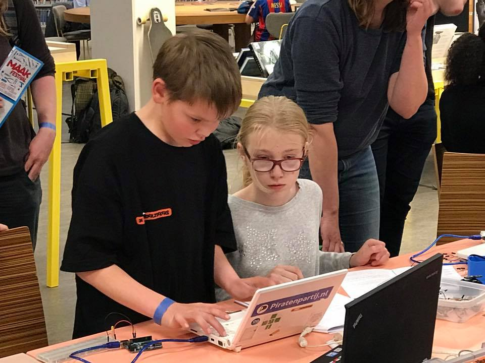
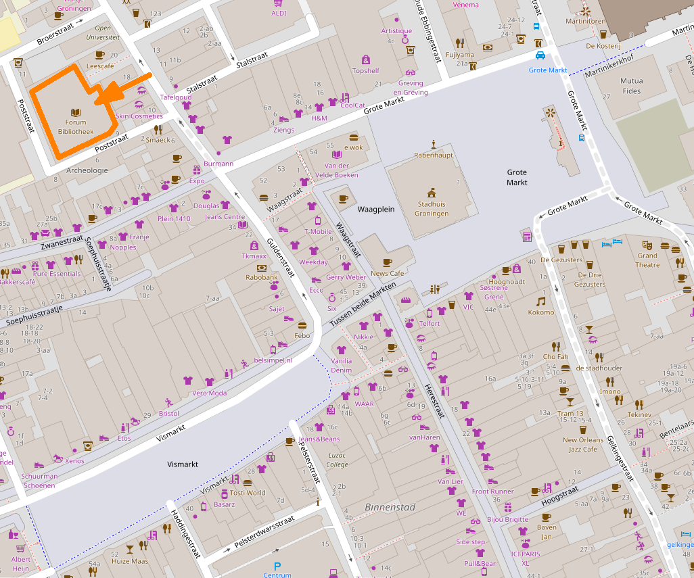

# maakfestival 2017

Activiteiten van De Jonge Onderzoekers, DIYbio en Hive5 op het [Maakfestival](https://www.maakfestival.nl)

20 Mei 10:00-17:00
Maakfestival, Oude Boteringestraat 18 (Openbare bieb), Groningen

## Agenda

Tijd|Waar|Activiteit|Wie
---|---|---|---
12/19 Mei ?18:00-20:00|?DJO N&T|?Oefenen DIY-DNA|?Peter, kinderen 
12/19 Mei ?19:00-21:00|?DJO N&T|?Oefenen DIY-Genome|?Alessio, scholieren
19 Mei 18:00-22:00|DJO en Maakfestival|Opbouw maakfestival|Richel, ?Arduino en N&T leerlingen
20 Mei 8:00-10:00|DJO en Maakfestival|Opbouw maakfestival|- (liever niet)
20 Mei 10:00-17:00|Maakfestival|Arduino|Thijs, leerlingen
20 Mei 10:00-17:00|Maakfestival|DIYbio|?Alessio, ?Claudio, ?Jolien, ?Kevin, ?Victor
20 Mei 10:00-17:00|Maakfestival|Dojo|?Dagmar, ?Jan, leerlingen
20 Mei 10:00-17:00|Maakfestival|N&T|?Bas, ?Peter, leerlingen
20 Mei 10:00-17:00|Maakfestival|Hive5|Sander, andere Hive5-ers
20 Mei ?|Maakfestival|DIY-DNA|?Peter, kinderen
20 Mei ?|Maakfestival|Human genome|?Alessio, scholieren
20 Mei 17:00-18:00|Maakfestival|Opruimen|Iedereen

## Groepen

Afkorting|Aanduiding
---|---
DJO|De Jonge Onderzoekers Groningen, [DJO website](https://www.djog.nl)
Dojo|Donderdagavond programmeercursus bij De Jonge Onderzoekers, [Dojo website](https://github.com/richelbilderbeek/Dojo)
Arduino|Vrijdagavond Arduino cursus bij De Jonge Onderzoekers, [Arduino website](https://github.com/richelbilderbeek/ArduinoCourse)
N&T|Vrijdagavond natuur & techniek cursus bij De Jonge Onderzoekers, [N & T website](https://github.com/dpstruwe/N-T-cursus-DJOG)
DIYbio|Groningse biologie makerspace, [DIYbio website](http://www.diybiogroningen.org/)
Hive5|Groningse hackerspace, [Hive5 website](hive5.nl/)

## Activiteiten

Groep|Activiteit
---|---
Dojo|Leer programmeren in Scratch of Processing van DJO leerlingen
Arduino|Leer electronica en Arduino van DJO leerlingen
N&T en DIYbio|?Leer hoe je een DNA extractie doet van DJO leerlingen
DIYbio|DNA extractie (zie hierboen) en ?Ensembl
Hive5|?Show and tell

## Spullen

 * Whiteboard (Alessio)

## Publiciteit

### DE JONGE ONDERZOEKERS | Cursus Arduino

Van [http://maakfestival.nl/programma/de-jonge-onderzoekers-cursus-arduino](http://maakfestival.nl/programma/de-jonge-onderzoekers-cursus-arduino):

Arduino is een populair computerplatform 
dat je kunt programmeren om input van schakelaars, 
lichtsensoren of bewegingsmeters om te zetten in 
output op een motor, lampje, pompje of beeldscherm. 
De mogelijkheden zijn eindeloos! 
Bij De Jonge Onderzoekers is al jaren een cursus Arduino voor en door leerlingen van 8 tot 18 jaar. 
Schuif aan en leer de eerste stappen Arduino programmeren.

### DE JONGE ONDERZOEKERS | Leren programmeren

Van [http://maakfestival.nl/programma/de-jonge-onderzoekers-leer-programmeren](http://maakfestival.nl/programma/de-jonge-onderzoekers-leer-programmeren)

Leer programmeren bij De Jonge Onderzoekers! Leerlingen van 8 tot 18 jaar kunnen hun eerste stappen zetten in Scratch of Processing.

### DIY-DNA | Haal DNA uit een aardbei

Van [http://maakfestival.nl/programma/bio-hacking-haal-dna-uit-een-aardbei](http://maakfestival.nl/programma/bio-hacking-haal-dna-uit-een-aardbei):

Deelnemers van alle leeftijden zijn welkom om mee te doen 
met dit kleurrijke experiment van Alessio Marcozzi. 
Je leert hoe je echt DNA uit een aardbei kunt halen enkel en 
alleen door het gebruik van zout, zeep en aardbeiensap. 
Het experiment is eenvoudig en simpel, iedereen kan het. 
En natuurlijk mag je je DNA na afloop meenemen.

### THE HUMAN GENOME | A crash course

Van [http://maakfestival.nl/programma/the-human-genome-a-crash-course](http://maakfestival.nl/programma/the-human-genome-a-crash-course)

In het jaar 200 werd de eerste versie van ‘The Human Genome’ gereleased. 
Bijna twee decennia later weet nog steeds niemand wat het is…

Tijdens deze workshop van DIYbio Groningen leer je de basis van ‘The Human Genome’; 
hoe je relevante informatie kunt opzoeken en vinden. 

Om mee te doen heb je een tablet of laptop nodig. 
En let op: deze workshop wordt in het Engels gegeven.

In English
In the year 2000, the first draft of the Human Genome was released. 
Almost 2 decades later, almost nobody knows it. 
During this workshop, you will learn the basics, 
where to get relevant information and how to surf it like you do with the internet.

The course is in English and to participate to the interactive sessions you will need a tablet or a laptop.

## Locatie 

